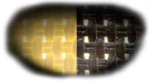

# Persianas técnicas

A lo largo de este artículo queremos compartirte los avances y estudios que han favorecido a que una persiana técnica sea mas que una «Persiana«. Extendemos un agradecimiento a nuestro socio comercial FARZ, por contribuir con la información y capacitaciones para que este blog sea presentado.

A lo largo de nuestra experiencia, nos hemos encontrados con proyectos de corporativos, oficinas en edificios, oficinas inteligentes, licitaciones de gobierno, escuelas y universidades, e incluso casas residenciales, donde nos externan la necesidad de una SOLUCIÓN al exceso de calor principalmente, al encandilamiento, reflejo de luz en pantallas de computadoras, etc.

Si te fue familiar alguna necesidad descrita anterior, o si estas buscando soluciones especificas de protección solar para interiores, este blog te sera de mucha ayuda.

Encuentra también este desarrollo dando click [**aquí**](https://zame-blinds.com.mx/persiana-tecnica/)

## Problematica existente en ventanas

Es sabido desde tiempos atrás, que la incidencia de luz del sol ocasiona diferentes tipos de problemas para nuestras actividades cotidianas, donde no muchas personas enfatizan en ello y prefieren dejar el problema por la paz.

Por otra parte, hay arquitectos que han encontrado esto como un problema a resolver y su propuesta ha sido diseñar en función a la salida del sol o mejor dicho, orientan la construcción acorde a los puntos cardinales para diferentes propósitos:

- Evitar la incidencia de sol
- Aprovechamiento de paneles solares
- Minimizar el calor en las ventanas
- Aprovechar la cantidad de luz del día
- ETC

### Calor excesivo

Muchas ventanas actúan de diferente manera de acuerdo con su incidencia de luz. La mayoría hacen el trabajo de una lupa y aumentan el calor dentro de una habitación

### Deslumbramiento y encandilamiento

En otras instancias, el exceso de luz incurre básicamente sobre las pantallas de televisiones o de computadoras mermando nuestra productividad o simplemente no dejando disfrutar de un momento de ocio.

## Pantalla solar

En términos de la decoración, una pantalla solar tiene la función de bloquear y/o descomponer la luz que se filtra en una habitación a través de una ventana.

Para ilustrar lo anterior, observa la siguiente imagen:

A manera de simplificar la imagen anterior, encontramos que la pantalla solar, o en términos coloquiales, la tela de la persiana que para análisis de este ejemplo es una tela perforada (tela screen 2000/4000, phifer) CUMPLE principalmente con el trabajo de descomponer en diferentes propiedades la incidencia de luz ocasionada por el sol.

Dicho esto, vemos que una parte ingresa a la habitación, otra se queda en la tela y otra parte se refleja hacia el exterior.

Todo esto tiene nombres y hasta se le asigna una numeración, lo cual veremos más adelante.

## Factores térmicos

Hablar de los factores térmicos nos permite entender porque sugerimos cuidar el tema de la elección de las persianas o cortinas.

Si nosotros visualizamos que la energía solar es compuesta de diferentes características cuantificables, podríamos entonces decidir sobre el tipo de tela que usaríamos para cubrir nuestras ventanas y no simplemente poner una tela porque es barata y me ahorrará algunos centavos.

La sumatoria que te permitirá decidir sobre la tela ideal

**RS + TS + AS = 100% Energía solar**

A todo esto, te preguntarás, _¿Qué es eso y como afecta en mis persianas?_

Bueno, te compartimos que estos tres factores térmicos te ayudaran como no tienes una idea para elegir, pero sobre todo, te ayudará a que las persianas que elijas cuenten con al menos una [certificación](https://zame-blinds.com.mx/certificaciones-de-persianas/), ya sea de calidad o de funcionalidad y te evitara que al paso de los años sea una persiana que termine en la basura.

**Factor térmico -- Descripción**
**RS = Reflexión solar**: Cantidad de energía solar reflejada por la tela
**TS = Transmisión solar**: Cantidad de energía solar transmitida a través de la tela
**AS = Absorción solar**: Cantidad de energía solar absorbida por la tela

Entendiendo lo anterior, nos gustaría explicarte que es cada cosa con palabras más comunes o mejor dicho, visto desde la parte practica.

**La reflexión solar** la podemos entender cómo la cantidad de luz que es reflejada de regreso al exterior. Si nosotros elegimos para nuestras persianas una tela con alto indice de reflexión solar podemos entender que estamos adquiriendo una tela que no permite el paso de calor hacía el interior

**La transmisión solar** atiende al tipo de tela que permite el paso de luz solar hacia el interior, es decir, elegir una tela con un alto indice de transmisión solar permite que la luz solar ingrese al interior del espacio en cuestión.

Finalmente, **la absorción solar** nos indica cuánta energía solar es «guardada» por la tela de una persiana. Esta característica la podemos relacionar sobre cuanto calor se queda en la tela o más coloquial aun, cuan caliente estará una tela al estar en contacto con la energía solar.

## Tejidos técnicos

Los tejidos técnicos son aquellos que han sido fabricados de tal manera que sus valores atienden a la solución de una problemática. No obstante, los tejidos técnicos han sido sometidos a diferentes tipos de certificaciones, la mayoría de talla internacional para que estos puedan ser utilizados para interiores o bien cumplir con normas rigurosas de algún país en una zona especifica.

Dentro de las principales características con las que cuentan estos tejidos son:

- 100% poliester (PVC Free)
- Reducción de deslumbramiento
- Disminución de calor
- Excelente vista al exterior
- Retardantes al fuego
- Ecológicos
- Garantía por escrito
- Certificaciones internacionales
- Ayudan en la acustica de un espacio
- Antibacteriales y antimicrobianos

En la siguiente imagen tomada de cerca, a manera de comparación entre el comportamiento que tiene una malla solar PVC y un tejido técnico metalizado podemos observar cómo es que se da solución al tema de deslumbramiento en persianas.

Cuando la energía solar incide sobre una malla solar se obtiene por lo regular una solución, sabiendo que se tienen dos problemáticas. Es decir, una malla solar te puede resolver el tema de el exceso de calor, pero queda vigente el tema del deslumbramiento. En contraste, sí el tema que se resolvió fue el del deslumbramiento, queda vigente el problema del exceso de calor.

Dicho lo anterior, veamos de cerca la siguiente imagen cuando se compara los tejidos de una persiana en función a la cantidad de luz recibida.

Veamos que cuando la malla solar se ilumina, ésta no retiene por completo la energía solar, específicamente a la característica de la reflexión solar. Por el contrario, cuando un tejido técnico para persiana es iluminado de la misma manera que una malla solar éste deja pasar luz únicamente por los ORIFICIOS, y no a través de los hilos como sucede con la malla solar.

Si este análisis lo extendemos a una ventana más metros cuadrados podemos entonces atender a la solución que nos ofrece una tejido metalizado en función al deslumbramiento cuando este recibe una excesiva cantidad de luz. Interesante, ¿no es así?

## Solución al exceso de calor – efecto invernadero

Inicialmente te queremos compartir el «Greenhouse effect» o mejor conocido como «efecto invernadero«, el cual consiste en que la radiación penetre por el vidrio transparente de una ventana e ingresa al interior del ambiente. Hasta aquí esta radiación solar no tiene temperatura (no es caliente ni fría).

Cuando esta radiación entra en contacto con los objetos del ambiente (paredes, pisos, escritorios, etc.), es absorbida y transformada en calor. Hasta entonces es cuando el calor se siente dentro de nuestro ambiente. No antes.

Debido a la transparencia del vidrio, la radiación solar lo atraviesa en un principio, pero cuando esta se convierte en calor, ya no es posible que lo atraviese de vuelta, quedando atrapado en el interior y generando altas temperaturas.

La solución que se propone para minimizar el calor dentro de un espacio (casa, oficina, etc) es implementar el uso de una persiana con tejido técnico, en donde acorde a la decoración, uso o necesidad, se selecciona uno especifico.

Retomando los conceptos de los factores térmicos, para disminuir la temperatura necesitamos una tela con alta REFLEXIÓN SOLAR (RS). En [**ZA-ME Blinds**](https://www.zame-blinds.com.mx), colaboración con nuestro socio comercial _Farz_, se propone utilizar el catalogo de tejidos técnicos cuyas características técnicas (**RS**) pueden llegar hasta con un indice del 81%.

¿Recuerdas que la energía solar la podíamos descomponer en tres elementos diferentes? La sumatoria de estos tres elementos (**RS, TS, AS**) debe ser del 100%. Un tejido técnico que te puede ayudar con prácticamente el 81% de la reflexión solar habla de cuan conveniente es implementar una persiana con estas características.

Como principal beneficio se encuentra la disminución de entre 3-5 grados de la temperatura interior. Para muchos esto puedes ser muy poco, pero si lo vemos desde el punto de vista en donde el aire acondicionado opera en función a la temperatura interna, esta diferencia de calor podría verse reflejada directamente en el uso del mismo representando grandes ahorros mensuales y anuales al disminuir el uso del A/AC.

## Solución al contacto con el exterior con persiana técnica

Una de las mas novedosas propuestas en el tema de persianas es la implementación de tejidos que dan solución al contacto con el exterior. ¿Qué significa esto?

Bien, imagina que por la razón que tú gustes y mandes, necesitas reducir la cantidad de luz que entra a tu oficina para evitar la incidencia de luz sobre las pantallas de las computadoras. Sin embargo, tu necesidad si bien es poner una persiana, necesitas NO PERDER contacto con el exterior.

Es aquí donde entra la funcionalidad de las persianas metalizadas, las cuales, aun cuando se encuentran en uso (abajo), tu no pierdes contacto hacía el exterior. En la siguiente imagen, tomada directamente desde las oficinas de nuestro socio comercial Farz, se muestra un caso real del uso de dichas persianas.

### Beneficios adicionales

Implementar persianas con tejidos técnicos, se pueden encontrar aun más beneficios, los cuales son categorizados de la siguiente manera:

- Sociales:
  - Confort térmico
  - Uso de luz natural y vista al exterior
  - Confort visual (ausencia de deslumbramiento)
  - Condiciones de trabajo más saludable
- Diseño
  - Correcto desempeño de color
  - Soluciones independientes de color interior
  - Uniformidad de la facha (vista del exterior)
- Económicos
  - Ahorro en aire acondicionado
  - Ahorro en iluminación
  - Ahorro en calefacción
  - Incremento en productividad (usuario final)

## VISITA NUESTRO SITIO WEB

[www.zame-blinds.com.mx](https://www.zame-blinds.com.mx)
